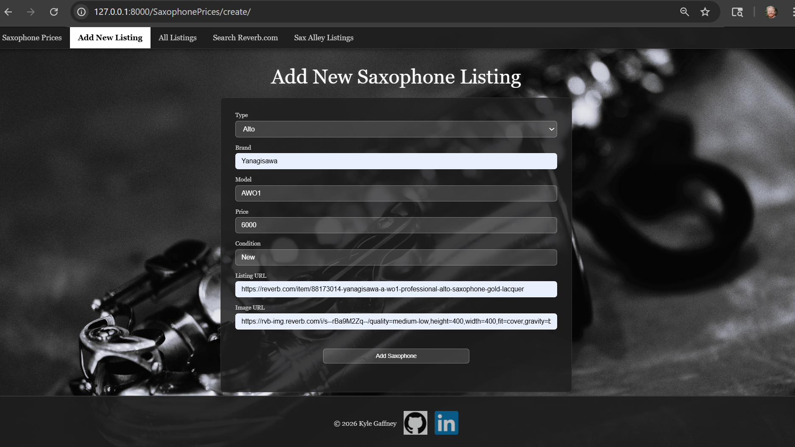
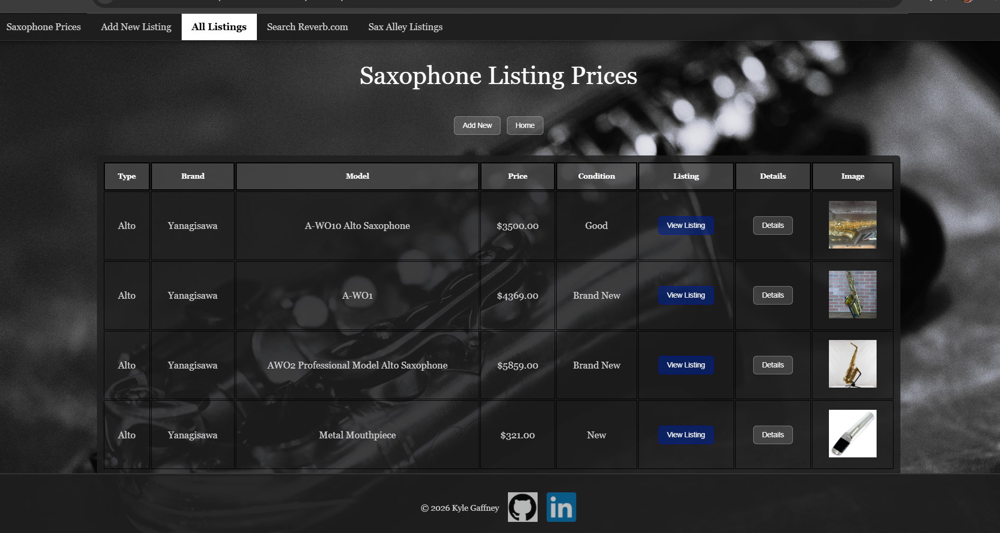
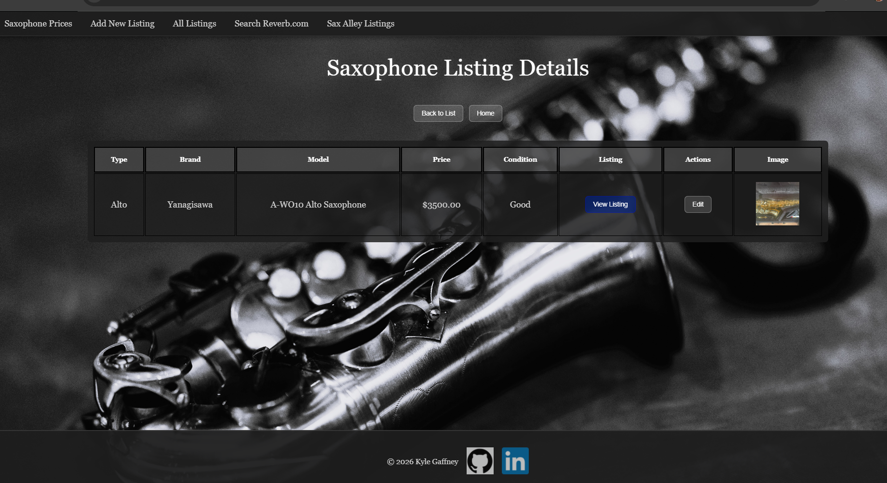
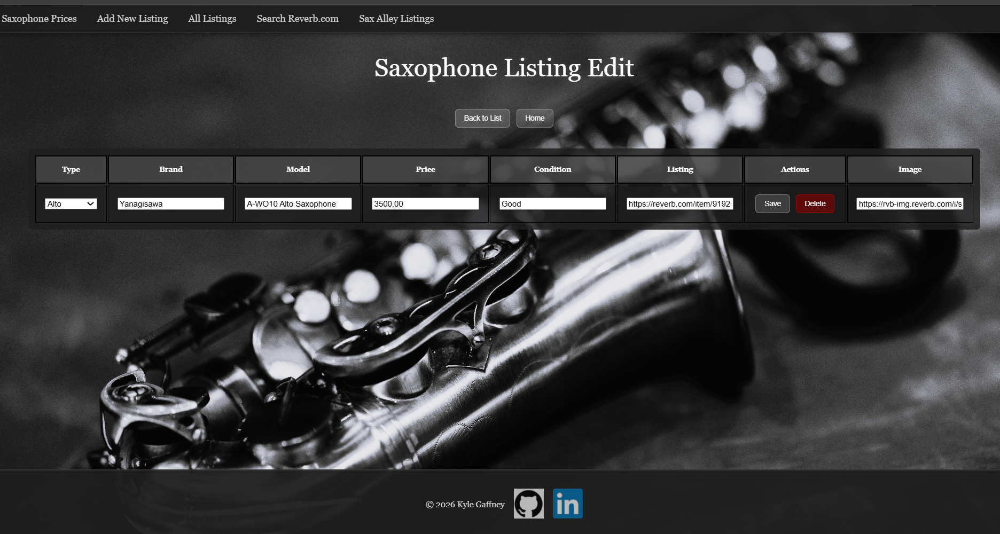
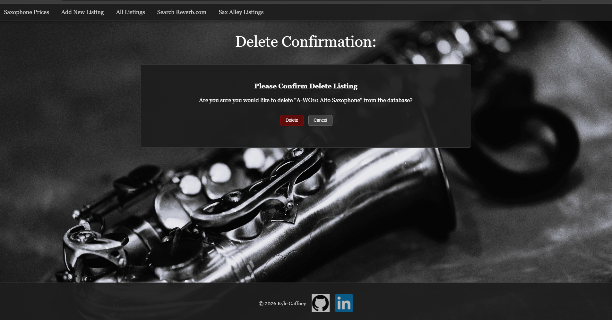
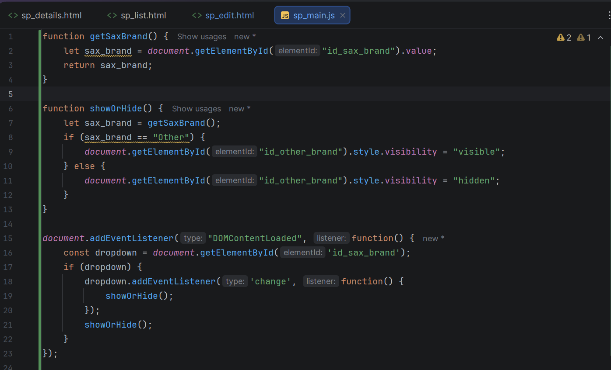

# Python Live Project (The Tech Academy)

## Project Overview
__Role__: Full-Stack Developer
__Tech Stack__: Django, Python, JavaScript, HTML/CSS, BeautifulSoup, Regex

Like many saxophone players, I do not have enough money to spend on saxophones, and the market fluctuates constantly. My Saxophone Prices Web App allows users to search, sort, and save different saxophone listings. I implemented foundational CRUD functionality to get data from Reverb.com's API and web scraping Sax Alley's site, filter through the listings, and save the desired listings to a database. Giving people access to more information empowers them to make more informed purchasing decisions. 

I did not have any development experience in a team environment, and this was my first time using modern best practice project management principles. Daily standups, sprint retrospectives, and consistent documentation through user stories all adhered to the Agile Scrum framework. All team members were individually responsible for designing, building, tracking progress using distinct branches with version control, and keeping Azure DevOps up to date.

## Core Technologies
- __Backend__: Django, Python
- __Frontend__: HTML, CSS, JavaScript
- __Database__: SQLite (via Django ORM)
- __APIs__: Reverb.com API (display data)
- __Libraries__:
    - BeautifulSoup (web scraping)
    - Regex (search pattern)
    - JSON (structure, transmit)
- __Version Control & Project Management__: Git, Azure DevOps

## Key Features
-Data Sorting: Most saxophone players do not have the luxury of yelling out "Money ain't a thing," so I needed to ensure the user could sort through the listings by price. But, we also care about the type of saxophone and the brand. When searching, the user can input different brands and saxophone types to limit the listings they recieve.

- API & Web-Scraping Integration: I used BeautifulSoup to scrape Sax Alley's site and display the current listings. I also used a RESTful API to query Reverb.com's API to get listings from a dedicated search.

- Normalized Data Presentation: Web Scraping offers very different results from a purpose built API. Through iterative development, I implemented a normalization layer to ensure both sources rendered consistently, improving legibility and usability.

- Saxophone Search: I found the order of the keywords in the search returned very different results. I attempted to guide the user in an optimal direction by separating the saxophone type from the brand in the search query. 

- Form Field PrePopulation: Due to somewhat inconsistent parameter naming like brand and model number, search results are imperfect. However, if the user would like to save any result, the save page will be pre populated with the values from the selected listing. It works with results from the API search and the web scraped results. 

## User Stories
1. [Basic App Design & Front-End](#basic-app-design--front-end)
1. [Model Creation](#model-creation)
1. [Display All Items](#display-all-items)
1. [Details, Edit, And Delete Functions](#details-edit-and-delete-functions)
1. [API (Connect & Parse)](#api-connect--parse)
1. [BeautifulSoup](#beautifulsoup)
1. [Front-End Improvements](#front-end-improvements)
1. [Save Results](#save-results)
1. [BugFix](#bugfix)

### Basic App Design & Front-End

I first needed to create the Django project itself so that I could present the basic content. I registered my SaxophonePrices App with the mainapp and built a basic HTML homepage. Saxophones are always too cool for school, so I wanted to build a fairly stripped down but clean CSS format that would naturally fit with the theme. I worked through a few different designs before settling on a way to give the user feedback when the pointer hovered over different elements, and how to convey where the user was to the user. And, because I am proud of what I accomplished with this project, I signed it at the bottom with links to my GitHub and LinkedIn.


### Model Creation
My next task was to actually make the database model. It is worth noting, that while my initial model made sense on paper, after getting further into the project, I needed to update the design multiple times to accommodate real life. I used Django's ORM to define the model and migrate the data to the table. My initial model design used more choices from lists I provided. After actually interacting with search results, I found that the brand and model naming conventions used were too inconsistent for me to rely on a set list of options for the user interface. This forced me to normalize the data later down the line.

```python

## Tuple list of saxophone types for the sax_type field choices dropdown.
## Each tuple contains (database_value, display_value) — both are the same here.
TYPE_CHOICES = [
    ("Sopranino", "Sopranino"),
    ("Soprano", "Soprano"),
    ("Alto", "Alto"),
    ("Tenor", "Tenor"),
    ("Baritone", "Baritone"),
    ("Bass", "Bass"),
    ("C Melody", "C Melody"),
]

class Saxophone(models.Model):
    """
    Represents a saxophone listing saved from either the Reverb API search results
    or the Sax Alley web scraper. Stores key listing details for price comparison.
    """
    sax_type = models.CharField(max_length=20, default="", choices=TYPE_CHOICES)
    sax_brand = models.CharField(max_length=20, default="")
    sax_model = models.CharField(max_length=50, blank=True, default="")
    sax_price = models.DecimalField(max_digits=10, decimal_places=2)
    sax_condition = models.CharField(max_length=20, default="Used")
    listing_url = models.URLField(max_length=200, blank=True, default="")
    sax_image = models.URLField(max_length=500, blank=True, default="")
    objects = models.Manager()

    def __str__(self):
        ## Returns a human readable string representation of the listing for debugging
        return f"{self.sax_brand} {self.sax_model} - {self.sax_type} (${self.sax_price})"

    class Meta:
        ## Sets the display name in the Django admin panel to avoid the default "Saxophones"
        verbose_name_plural = "Saxophone Prices"
```

I needed a form to allow users to input data entries. This form design also evolved over the project. I wanted to limit the user's options to normalize data at the beginning, but because of how varied input might be, I revised this form multiple times. I wanted all of the fields to fit on one page, and leave very little room for interpretation. The widgets I added can convey to the user the optimal way to enter data.


```python
class SaxophoneForm(forms.ModelForm):
    """
    ModelForm for creating and editing Saxophone listings in the database.
    Used by the create and edit views. When saving from search and scrape results,
    the form is pre-populated with data passed via URL parameters.
    """
    class Meta:
        ## Bind this form to the Saxophone model
        model = Saxophone
        ## Only expose these fields in the form — excludes the auto-generated primary key
        fields = ['sax_type','sax_brand', 'sax_model', 'sax_price',
                  'sax_condition', 'listing_url', 'sax_image']

        ## Custom widgets override Django's default form field rendering
        widgets = {
            'sax_type': forms.Select(attrs={
                'class': 'custom-dropdown'
            }),
            'sax_brand': forms.TextInput(attrs={
                'placeholder': 'Yamaha, Yanagisawa, ...'
            }),
            'sax_price': forms.NumberInput(attrs={
                'placeholder': '0.00',
                'step': '0.01'
            }),
            'listing_url': forms.URLInput(attrs={
                'placeholder': 'https://...'
            }),
            'sax_image': forms.URLInput(attrs={
                'placeholder': 'https://...'
            }),
        }

```


It took some trial and error, but after hooking up the form to add a new listing to the database, I reached a front end that made sense.



### Display All Items

The next story required me to build a page to display all of the database entries. I made the initial design that made sense with the initial database model, but like everything else, the end result looks quite a bit different from the first iteration. I repurposed as much styling as I could throughout the process. And I tried to minimize repeating code as much as possible. This became the archetype for the tables I used in HTML and CSS, and the view method sends all of the saved database entries to the table.


Two elements of the database display that turned out particularly well are the listing button, and the image. Both are very basic concepts, but presented a few challenges during the iteration process. The listing url for different results was quite different, and I had to normalize how I saved the data using urlencode from the urllib.parse library later on. And I did not initially intend on saving an image with each entry in the database. But, obviously every retailer will provide an image for a reason. I first tried to save image files, but that proved quite inconsistent. And eventually I was able to just save the image url, and get around more dangerous data management.

```html

    <div class="sax_list">
        <!-- Navigation buttons for adding a new entry or returning home -->
        <!-- Add New hooked up to create view with a blank form -->
        <div class="frmBtn_container">
            <a href="">
                <button type="button" class="btn">Add New</button>
            </a>
            <a href="">
                <button type="button" class="btn">Home</button>
            </a>
        </div>

        <!-- Table displaying all saxophone listings currently saved in the database -->
        <!-- saxophone_list is a queryset of all Saxophone objects from the database -->
        <table class="saxophone-table">
            <thead>
            <tr>
                <th>Type</th>
                <th>Brand</th>
                <th>Model</th>
                <th>Price</th>
                <th>Condition</th>
                <th>Listing</th>
                <th>Details</th>
                <th>Image</th>
            </tr>
            </thead>
            <tbody>
            
                <tr>
                    <td>{{ saxophone.sax_type }}</td>
                    <td>{{ saxophone.sax_brand }}</td>
                    <td>{{ saxophone.sax_model }}</td>
                    <!-- Price is stored as a decimal in the database and $ is added here -->
                    <td>${{ saxophone.sax_price }}</td>
                    <td>{{ saxophone.sax_condition }}</td>
                    <!-- Opens the saved listing URL in a new tab -->
                    <td><a href="{{ saxophone.listing_url }}" target="_blank">
                        <button type="button" class="btn btn-listing">View Listing</button>
                    </a></td>
                    <!-- Details button links to the details view using the entry's primary key -->
                    <td class="action-buttons">
                        <a href="">
                            <button type="button" class="btn btn-details">Details</button>
                        </a>
                    </td>
                    <!-- Displays the saved image URL as a thumbnail -->
                    <td></td>
                </tr>
            
            </tbody>
        </table>
    </div>
```

### Details, Edit, And Delete Functions
The next story required me to present the details of each entry in the database. I needed to keep the user experience smooth, and I added a "Details" button to the database table for the user. My initial design for the details page looked more like the entry form, but after revision, I chose to make it a table that looks more like the other pages. I recognize that some retailers have a more in depth view for each individual listing, but my goal with this project was to simplify the buying process, not add more complication and over load the user with needless information. The details page is simple, and I wanted to prevent any accidental entry deletion, so I chose to protect the edit and delete functions behind an "Actions" button. 




I wanted to ensure the user knew they were editing an existing listing, so I chose to make the edit page layout more like the table instead of the "create new" form. And because I have made many mistakes, I chose to force the user to confirm they do indeed want to delete an entry.




```python
def saxophone_prices_edit(request, pk):
    """
    Retrieves a specific saxophone listing from the database by primary key and
    pre-populates the edit form with its current values. Validates and saves the
    updated entry on POST request, then redirects to the saved listings page.
    """
    pk = int(pk)

    ## Retrieve the saxophone entry by primary key, or return a 404 if it does not exist
    item = get_object_or_404(Saxophone, pk=pk)

    ## Instantiate the form with the existing database entry as the instance
    ## This pre-populates all form fields with the current values from the database
    ## On POST, the form is populated with the submitted data instead
    form = SaxophoneForm(data=request.POST or None, instance=item)

    ## Only attempt to save if the user submitted the form (POST)
    if request.method == "POST":
        ## Validate the submitted data against the model's field constraints
        if form.is_valid():
            ## Save the updated values to the database and redirect to the listings page
            form.save()
            return redirect("saxophone_prices_list")
        else:
            ## Log any validation errors to the terminal for debugging
            print(form.error_class)

    ## On GET request, pass the pre-populated form to the edit template for display
    ctx = {"form": form}
    return render(request, "SaxophonePrices/sp_edit.html", ctx)


def saxophone_prices_delete(request, pk):
    """
    Retrieves a specific saxophone listing from the database by primary key and deletes it.
    Displays a confirmation page on GET request, and performs the deletion on POST request.
    Redirects to the saved listings page after successful deletion.
    """
    pk = int(pk)

    ## Retrieve the saxophone entry by primary key, or return a 404 if it does not exist
    listing = get_object_or_404(Saxophone, pk=pk)

    ## Only delete the entry if the user confirmed by submitting the delete form (POST)
    ## This prevents accidental deletion from a direct URL visit (GET)
    if request.method == "POST":
        listing.delete()
        return redirect("saxophone_prices_list")

    ## On GET request, pass the listing to the confirmation template so the user
    ## can review what they are about to delete before confirming
    ctx = {"listing": listing}
    return render(request, "SaxophonePrices/sp_confirm_delete.html", ctx)
```

I used the primary key of the database entry to send the desired entry around through the all listings table, to the details page, to the edit page, and then to the delete functionality. I chose to send the user onward in the chain using the Python-Django redirect instead of JavaScript because I am much more comfortable in Python than JavaScript.



### API (Connect & Parse)
The next story required me to integrate a third-party API and present the JSON response, and this was where things got exciting. I did not read far enough ahead in the instructions before I started the initial design of my database model in Django, and integrating the API results started the cascading iteration. And this search function is the result of A LOT of trial and error. While I chose the Reverb.com API before I started the project very deliberately because the documentation seemed very helpful, I never actually looked at the results it returned until this step. A search to the reverb.com API will return ALL listings that fit the search parameters, and that quickly needed curating. I chose to only show the user the first 5 results in an attempt to mitigate overwhelming the user.


```python
def saxophone_prices_search(request):
    """
    Sends a request to Reverb.com's API based on user search parameters and returns
    the first 5 results, displaying each listing in a table with title, type, brand,
    model, price, condition, and image.
    """
    ## Get the brand and type search values submitted by the user via GET request
    user_search_brand = request.GET.get("user_search_brand", "").lower()
    user_search_type = request.GET.get("user_search_type", "").lower()

    ## Combine brand and type into a single search string based on what the user provided
    ## Type is placed before brand for better Reverb search results like "tenor yamaha"
    user_search = ""
    if user_search_brand and user_search_type:
        user_search = f"{user_search_type} {user_search_brand}"
    elif user_search_brand:
        user_search = user_search_brand
    elif user_search_type:
        user_search = user_search_type

    ## Empty dictionary to hold formatted listing data before passing to the template
    formatted_listings = {}

    ## Only make the API call if the user provided at least one search value
    if user_search:
        ## Append "saxophone" to the query to filter results to saxophones only
        sax_search = f"{user_search} saxophone"

        ## Send authenticated GET request to Reverb API
        ## category_slug limits results to saxophones, per_page limits to 5 results
        response = requests.get(
            'https://api.reverb.com/api/listings',
            headers={
                "Authorization": "Bearer User_Token",
                "Accept-Version": "3.0"
            },
            params={"query": sax_search, "category_slug": "saxophones", "per_page": 5}
        )

        ## Only parse the response if the API call was successful
        if response.ok:
            ## enumerate() provides an index i used as the dictionary key for each listing
            for i, listing in enumerate(response.json()["listings"]):
                ## Extract the desired fields from each listing and store in the dictionary
                ## photo URL uses small_crop for thumbnail display in the table
                formatted_listings[i] = {
                    "title": listing["title"],
                    "type": user_search_type.title() if user_search else "",
                    "brand": listing["make"].title(),
                    "model": listing["model"],
                    "price": listing["price"]["display"],
                    "condition": listing["condition"]["display_name"].title(),
                    "url": listing['_links']['web']['href'],
                    "image": listing["photos"][0]["_links"]["small_crop"]["href"],
                }

    ## Pass formatted listings and original search terms back to the template
    ## Search terms are passed back so the input fields retain their values after searching
    ctx = {"listings": formatted_listings,
           "user_search_brand": user_search_brand,
           "user_search_type": user_search_type}
    return render(request, "SaxophonePrices/sp_search_results.html", ctx)
```


I eventually restructured the database model to take in a pure string for the brand, but initially I presented the user with a dropdown menu for the most common brands and "Other". But it looked weird when presenting the data in the search page, so I went looking for a way to toggle the visibility of the "other" brand field. And while I later removed this JavaScript, the biggest thing I relearned in this section was the way data loads on the page. Sometimes the "Other" field would load correctly, but others it would not. I was not checking if the "other" brand was present at the correct time. I needed to wait for the html to be parsed before I checked to see if the "Other" brand was selected in a particular entry. Live and learn.




I did however use JavaScript to filter the search results by price. Behind the curtain, all of the search results always load, but we only display the ones within the users desired price range. It took some internet searching to find out how to only use the decimal value from the strings I was storing for the price. This line was the big learning moment for me with finding the chars I wanted to remove using the correct syntax and cutting them out at the correct time in the operation. textContent.replace(/[$,]/g, "").trim()
```javascript
/**
 * Filters the saxophone table rows based on user-defined minimum and maximum prices.
 */
function filterByPrice() {
    // get the min and max price and turn them into floats
    const minPrice = parseFloat(document.getElementById("min-price").value) || 0;
    const maxPrice = parseFloat(document.getElementById("max-price").value) || 99999;


    // get all of tr elements from the tablebody
    const rows = document.querySelectorAll(".saxophone-table tbody tr");

    // iterate through each row, get the price cell, check if there is no price cell
    // get the price text, and replace the symbols and empty space with nothing
    // make the price a float instead of a stirng
    // check that each price is a number, that it is within the set range
    // if it is, then set the row style display to "" else, set it to none
    rows.forEach(row => {

        const priceCell = row.cells[4];
        if (!priceCell)
            return;

        const priceText = priceCell.textContent.replace(/[$,]/g, "").trim();
        const priceFloat = parseFloat(priceText);

        if (!isNaN(priceFloat) && priceFloat >= minPrice && priceFloat <= maxPrice) {
            row.style.display = "";
        } else {
            row.style.display = "none";
        }
    });

}

/**
 * Resets the price filter inputs and restores visibility to all table rows.
 */
function clearFilter() {
    // clear the input fields
    document.getElementById("min-price").value = "";
    document.getElementById("max-price").value = "";

    // get all of the rows
    const rows = document.querySelectorAll(".saxophone-table tbody tr");
    // iterate through each row and show it
    rows.forEach(row => row.style.display = "");
}

// Automatically update the footer copyright year to the current calendar year
document.getElementById("copyright-year").textContent = new Date().getFullYear();
```


### BeautifulSoup
The next story required using BeautifulSoup to scrape a webpage for relevant data. Again, this started cascading iterations of all of the other parts of the project. WebScraping returned very different results from the dedicated search. At first, I did not see an issue with having very different results across the database, the API results, and the web scraped results, but after actually using the site, The tables and data within them all needed to be consistent. The big gain from this block was learning how to specifically pull the data I needed from each listing on the Sax Alley page. It was easy enough to identify the listings themselves, but consistently getting the correct Brand and Model was much more challenging. I eventually had to learn how to use regex search and syntax to find a style of pattern within a raw string. The end result works well for many saxophone models, but not all. Especially since many vintage saxophone model names are nicknames that do not have an alphanumeric pattern like a modern model. 

An additional challenge I ran into was how to identify the saxophone type and brand. I built out lists of common brands and saxophone types, then made an initial block that searched through each list to try and find a match in the listing's title. This search was at best O(n * m), but the block took up way too many lines, and I went on a quest to find new and helpful python functions. I had never used next(), and while the function simply returns the next item in an iterator, it saved me multiple lines of code in both sections and made the block much more readable. The search complexity is still the same, but the way I got there was much more efficient.

It was also at this point when I started to deliberately normalize the table layout for each page. It also simplified styling elements so I could use CSS classes as they were intended.


```python
def sax_alley_listings(request):
    """
    Scrapes the first page of Sax Alley's all saxophones page and displays
    each listing in a table with title, type, brand, model, price, condition, and image
    """

    ## Mimics a real browser request to avoid a 403 Forbidden error from Sax Alley's CDN
    headers = {
        "User-Agent": "Mozilla/5.0 (Windows NT 10.0; Win64; x64) AppleWebKit/537.36 (KHTML, like Gecko) Chrome/147.0.0.0 Safari/537.36"
    }

    ## Send GET request to Sax Alley's saxophones page with the browser headers
    response = requests.get("https://www.saxalley.com/shop/Saxophones.htm", headers=headers)

    ## Convert the raw HTML response text into a BeautifulSoup navigable object
    sax_alley_page = response.text
    sax_alley_soup = BeautifulSoup(sax_alley_page, 'html.parser')

    ## Find all product card containers — each cItemDiv holds one saxophone listing
    product_divs = sax_alley_soup.find_all("div", {"class": "cItemDiv"})

    product_list = []

    ## Iterate through each product card and extract the desired data points
    for div in product_divs:
        ## Extract the title <p> tag with class "cItemTitle"
        prod_title = div.find('p', {'class': 'cItemTitle'})

        ## Extract the price <p> tag with class "cItemPrice" and strip $ and , symbols
        prod_price = div.find('p', {'class': 'cItemPrice'})
        prod_price = re.sub(r'[$,]', '', prod_price.text.strip())

        ## Default price to "Unknown" if the listing has no price (e.g. sold out items)
        if not prod_price:
            prod_price = "Unknown"

        ## Extract the listing URL from the <a> tag's href attribute
        prod_listing = div.find('a').get("href")

        ## Extract the image URL from the  tag's src attribute
        prod_image = div.find('img').get("src")

        ## Only process listings that have all three required elements
        if prod_title and prod_price and prod_listing:

            ## Use regex to extract model numbers that follow patterns like YTS-62III or CTS-50V
            ## Returns "Unknown" if no alphanumeric model number pattern is found in the title
            model_match = re.search(r'\b[A-Z]{2,4}-\d+\w*\b', prod_title.text.strip())
            model = model_match.group(0) if model_match else "Unknown"

            ## Lowercase the title for case-insensitive string comparisons below
            sax_title = prod_title.text.strip().lower()

            ## Check title against TYPE_CHOICES list to identify saxophone type
            ## next() returns first match or "Unknown" if no type is found
            sax_type = next((t for t in TYPE_CHOICES if t in sax_title.title()), "Unknown")

            ## Check title against BRAND_CHOICES list to identify the brand
            ## next() returns first match or "Unknown" if no brand is found
            sax_brand = next((b for b in BRAND_CHOICES if b in sax_title.title()), "Unknown")

            ## Determine condition from title text since it is not a separate field on the page
            if "new" in sax_title:
                sax_condition = "new"
            elif "used" in sax_title:
                sax_condition = "used"
            else:
                sax_condition = "Unknown"

            ## Append the extracted data as a dictionary to the product list
            product_list.append({
                "title": prod_title.text.title(),
                "type": sax_type.title(),
                "brand": sax_brand.title(),
                "model": model,
                "price": prod_price,
                "condition": sax_condition.title(),
                "url": prod_listing,
                "image": prod_image,
            })

    ## Pass the completed list of listing dictionaries to the template for rendering
    ctx = {"product_list": product_list}
    return render(request, "SaxophonePrices/sp_sax_alley_listings.html", ctx)
```

### Front-End Improvements
The next story required me to update the front end of the site. This actually required more back end work than front end work. I needed to normalize the data from the API search results, the web scraping results, and then the database I saved to itself. I had to get more data from the web scraping, less from the API search, and then normalize that data so that a user could make sense of it. I eventually settled on listing attributes that seemed like the most essential AND that I could access across both platforms. Then I had to update the model itself, then try to layout the tables in a way that made sense. Undoubtedly there are more ways that someone could structure the tables, but the end result makes sense and it looks the way I wanted it to.


### Save Results
To round out our web-scraping functionality, this next task was to build functionality that assisted users in saving information detailed in the web-scraped or API data to the database. As my web-scraped data was the only legitimate data of the two, I opted to use that. In order to help users save tea data from their web-scraped data, I also opted to use JavaScript. First, I turned the record/row names on the Site Info table into links to the Create page. I then used JavaScript's event listener to, upon click, pull all data from that selected row into session data in JSON format.

```html
<!-- Save button passes listing data as URL parameters to the create view -->
                    <td>
                        <a href="?type={{ saxophone.type|urlencode }}&brand={{ saxophone.brand|urlencode }}&model={{ saxophone.model|urlencode }}&price={{ saxophone.price|urlencode }}&condition={{ saxophone.condition|urlencode }}&url={{ saxophone.url|urlencode }}&image={{ saxophone.image|urlencode }}">
                            <button type="button" class="btn btn-save">Save</button>
                        </a>
                    </td>
```

The next story required me to save the results. A big consideration in how I normalized the table presentation in the previous step was in service of saving the results on this story. On paper, sending the listing results to the "create new saxophone form" was pretty straight forward. However, consistently sending the data proved challenging. An issue that I started running into was particularly with the image urls. Sometimes it would work, But other times, the image url would be cut off. I learned that some symbols, like '&' can be interpreted as a query parameter separator, which makes passing the data from the listing to the form worthless. This was also a great way to reinforce how the flow of control works in Django. Passing the view, and then the parameters we want to use in that view of course makes sense, but the syntax Django uses has often confused me. 

Another odd issue I was running into was which value to use as the alt image tag. I went through a number of options with f strings, and brand/model combinations. I eventually decided that the type of saxophone was enough data, and more importantly, I could consistently get that attribute and present it, because not all of the listings had easy to find brand names and model numbers. 

Prepopulating the form data to save a new saxophone listing was important because there is no way a saxophone player has the attention span and the short term memory to remember all of the values in a table and then accurately type them into the "create new" form. 
This process also forced me to revise the table layout. I chose to remove the "Title" column from the database. It no longer seemed necessary if the user already chose to save a listing, and if the user chose to manually input all of the values, coming up with a title seemed very odd. The database table does not exactly match the search results for this reason.


### BugFix
The last story was fixing bugs. My biggest issue I was running into was actually with how the database listings were being presented. I had to update the database model, the all listings table, and the details pages to more accurately show the current iteration of attributes I wanted to use.


### Future Improvements
- In attempting to add '$' to listing prices at the correct stage, I do not think the formatting looks great. I am sure there is a better place to insert the '$" into the price attribute. Additionally, sometimes listings had a price range, and I could not find a consistent way to accommodate the variation listings had. 
- The form uses Django validations for my form, and they work. However, I think there is a more robust way to normalize saxophone types, brands, and model numbers. 
- I chose to use 'clamp' in my styling to accommodate different size screens. This works ok on most desktops, but the data-driven webpage with tables looked goofy on a phone. Down the road, updating the CSS media query could help mitigate the weirdness. 
- I do genuinely think limiting the amount of results was a good decision on the API search, but in hindsight, giving the user the ability to select how many they want would have been better. 
## Conclusion
I set out to make an intuitive way for people in the market for a new saxophone to compare pricing options. I used all of the tools I have learned over the last few months to accomplish this goal. I have a very strong foundation of self learning, and while practicing skill development is always valuable, working within a structured team environment was very new for me.  A very big lesson for me was abandoning bad ideas earlier is better than following the sunk cost fallacy. I had a feeling the "other" brand solution I initially found was sub optimal, but because I spent quite a bit of time on it, I tried to figure out any way I could to keep it. In the future, I will aim for simpler solutions that work at scale. But also the team dynamic was also new in relation to software development for me. Updating the grownups on my progress daily, and ensuring I complete all of my tasks on time was essential to the overall project success. I used regex and the "next" function in python for the first time, and developing my vocabulary in programming languages allows me to solve more problems down the road.

### Key Learning and Challenges-
- __Research & Self-Learning__:  I firmly believe that the will to solve a problem will carry me further than the tools available to solve it, and this project was no exception. I sifted through documentation to get the API operational, then determined how to extract the specific data I needed from the results. While I had prior experience making API calls, each integration presents new challenges that demand close attention to detail.
    - _API Integration_:  Using the correct request methods for the API, then handling and manipulating the JSON responses into several different formats for display.
    - _Web-Scraping_:  I have mixed feelings about using BeautifulSoup going forward. Given the current socioeconomic climate surrounding big tech and data privacy, I will most likely seek explicit permission before web scraping in the future. That said, the process of digging through external websites, extracting and reformatting data, and integrating it across multiple display contexts helped sharpen my problem-solving skills.
    - _Regex_:  I learned to use regex to extract specific patterns from raw text and reformat that data for storage as dictionary entries.
    - _View-Switching_:  While there are different schools of thought, I value consistency and legibility. I learned that normalizing data at the correct stage is critical to displaying it in the desired format.
    - _Search Functionality_:  I learned that deliberately ordering the terms of a user search query before executing it can drastically change the results. I had not fully appreciated how differently search algorithms weight word order.
    - _Sorting_:  I learned how to sort data based on decimal values. While not overly complex, getting the functionality to work consistently with inconsistent data taught me how to deliberately parse and standardize data storage.    - _Prepopulating Fields/SessionData Uploading_: I learned how to use Django and HTML together to pass data between pages. While straightforward in concept, finding a reliable method to carry data from a listing to a form required significant research.  
- __Worked within the Scrum Framework__: While I have always worked professionally within a team, I had no prior development experience in a group setting. Daily stand-ups, retrospectives, and sprints were all new to me. However, strong time management and communication go a long way toward team cohesion, and I carried my share of the workload. Using Azure DevOps to track story progress, manage version control, and maintain overall project perspective all made considerably more sense in practice than in theory.
- __Planning Before Development__: I learned the value of thoroughly reading the requirements before diving into a large problem. Understanding the code standards made sense, but the required style and conventions were new to me and needed revision. My biggest takeaway was the importance of planning on paper before starting future projects. My initial design had gaps I had not anticipated, but with more experience I can hopefully identify small problems before they become large ones.
- __Version Control and Pycharm__: I had always used Visual Studio and Git via the command line, but this project required PyCharm and its integrated GUI for version control. This took some adjustment, but I came away with a significantly higher proficiency in PyCharm — including branching, committing, and pushing work to the main repository while adhering to best practices. 
- __Full-Stack Development__: This was the first Django project where I felt I used every tool at my disposal. I gained practical knowledge in managing control flow and deliberately manipulating data, while maintaining consistent attention to detail on the front end in service of the user experience.
- __Problem Solving and Debugging__: Experience is something you gain immediately after you need it — and I now have considerably more than when I started. Learning to search effectively for solutions, identify the relevant details in an error, and adapt example code to fit my specific needs was central to this project. Going forward, I will be quicker to abandon unproductive approaches and make greater use of browser developer tools for efficient debugging. 

_Jump To_: [Project Overview](#project-overview), [Key Features](#key-features), [Basic App Design & Front-End](#basic-app-design--front-end), [Model Creation](#model-creation), [Display All Items](#display-all-items), [Details, Edit, And Delete Functions](#details-edit-and-delete-functions), [API (Connect & Parse)](#api-connect--parse), [BeautifulSoup](#beautifulsoup), [Front-End Improvements](#front-end-improvements), [Save Results](#save-results), [BugFix](#bugfix), [Future Improvements](#future-improvements), [Conclusion](#conclusion)
